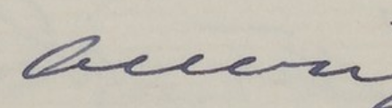
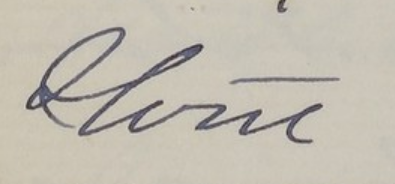

> It is such a comfort to think of your coming back though, + such a pleasure to know that you will be happy here, + that we shall soon be at work again together…believe me as ever dear dear doctor with love from EMC.”[^1] 

[^1]: Elizabeth Cushier to Emily Blackwell, Letters to Emily Blackwell, n.d.; includes letters from Emily Blackwell's companion, Dr. Elizabeth Cushier, from Mary Putman Jacobi, Marie Blackwell Droussart, and E.S. Minturn re: Harvard Annex entrance examinations, Papers of the Blackwell family, 1831-1981, MC 411, 187., Box 20, Schlesinger Library on the History of Women in America, Harvard Radcliffe Institute. https://id.lib.harvard.edu/ead/c/sch00050c00224/catalog Accessed May 12, 2026.

This is an excerpt from a letter sent by Elizabeth Cushier to her long-term partner and housemate, Emily Blackwell, written sometime between 1883-1910. Here, Cushier shows her love and care for the other woman and simultaneously draws a tie between her medical profession and their love. Cushier, also a doctor, in this small excerpt, divulges an intimate connection between love shared amid two women and nineteenth-century medical professionals

## Building Careers and Correspondence

Living in New York City in the year 1869, a thirty-two year old Elizabeth Cushier took the bold step to join the world of professional medicine. She entered The Women’s Medical College of the New York Infirmary, one of the few institutions in America concerned with the training and staffing of women medical professionals, and her life changed forever. Not only would she become one of the handful of women capable of practicing professional medicine in America, but she would also meet the woman she would spend the rest of her life with, Emily Blackwell. Blackwell herself pioneered women joining the medical profession and became the third female doctor in America after she received her M.D. in 1854. She founded and ran The Women’s Medical College that Cushier decided to attend.  There, in that groundbreaking space, Cushier and Blackwell connected and built their lives together.

Cushier and Blackwell had to contend with a complex relationship between their professional and private lives. In their professional lives, they defied traditional gender roles by assuming a job that actively excluded women. In their private lives, they defied traditional sexual roles by never marrying a man and choosing to live and make a home with a fellow woman doctor. Their letters, between each other, family, and friends, reveal how they navigated their non-normative gender and sexuality. 

Within the intimate form of letters, they created a strict rhetorical line between their work and their home life to maintain their authority and their love for one another. While a non-normative gender or sexuality expression on its own might have been difficult to defend and maintain, the combination of the two that Cushier and Blackwell carried necessitated strategic boundary making to naturalize their relationship and authority as doctors. 

Although they constructed rhetorical boundaries between their professional and private lives, the proximity of their discussions of work and home life shows how Cushier and Blackwell’s relationship could not be separated from their identity as doctors. Meeting and building their relationship in a medical institution, they defined their love through reaffirming each other’s authority as doctors. Their letters demonstrate two things: an ingrained perimeter between the professional and intimate and, simultaneously, a relationship that transcended public and private barriers because of their status as medical professionals. 

Notes on Queerness

 

Historians of sexuality, and historians in general, frequently debate whether or not it is acceptable to apply modern labels to historical actors. They question if it is responsible to call someone ‘gay’ or ‘lesbian’ when those terms did not exist, were not popularized, and they would not have thought of themselves in this way. On the other side, if we do not name categories of non-normative sexualities, it could contribute to an erasure of gay, lesbian, and/or trans histories, framing gay-ness or transness as a modern phenomenon. 

My thoughts lie somewhere in the middle, in the messiness that queerness often exists in. For this reason, I will refer to Cushier and Blackwell’s relationship as queer. I define queer as deviant from normative sexual and gender roles. Their relationship existed outside the bonds of normative sexualities (the specifics of which will be discussed later), and they shared a deep, emotional, if not physical, love together. I use queer here as an analytical category rather than a label. They may have thought of themselves and their relationship the way we conceptualize modern lesbians, and historians have categorized them this way, but it is impossible to know anything for certain beyond what their sources tell us. 

  

Notes on Legibility 

 

19th century women wrote in beautiful cursive to express their loving thoughts to one another. That cursive is also very difficult to read. While all of the letters used have been transcribed, the transcription for the letter from Cushier to Blackwell had some gaps. With time, I was able to figure out some of these gaps (like how Cushier assured her patient that she was not wicked). However, some words still eluded me, nothing that changed the meaning of the overall text, but it was still frustrating, nonetheless. At the end of her letter, Cushier wrote “It must have seemed real sad my own, dear doctor to say good bye to the (unclear) for a whole year - I often think of it with longing, + shall until I find myself on our (unclear) again. It is such a comfort to think of your coming back though, + such a pleasure to know that you will be happy here.” This section contained some lovely sentiment that I would have liked to have included, if only not for those unclear words. 

To solve this, I consulted leading experts on 19th century cursive paleography, aka my friends and family. This was far from rigorous academic data gathering, but it was fun to see what everyone guessed based on the varied context I provided. I gave them the words without any context first, then provided the transcribed quote, and then provided the whole page of the letter. The following is a list of possible guesses to the mystery words:

Mystery Word One: ocean (two responses), queen (two responses), queer (three responses) 

Mystery Word Two: glerte (?), gleret (??), slert (???), Home (two responses), olerie (one response and a real word from the 1890s!), store (one response), shore (one response)

Based on the fact that Cushier and Blackwell had a summer home in York Cliffs, Maine, right by the water, I think the most plausible answer is ocean and shore. During their year apart, Cushier stayed in their Manhattan home, evidenced by her writing of her frequent trips to Harlem. It makes sense, then, that she would long for their shared house by the ocean and endearingly refer to the place as “our shore.” However, in doing this unintentional little experiment, I became comfortable with the idea that I might never know. 

Cushier never wrote her letter intending for it to be read by the public; it was meant to be an intimate moment shared between her and her partner only. By sharing this letter, I participate in a sort of ‘outing’ that exposes the intimate lives of these women. It seems okay to me that they get to keep something for themselves, even if it is just two words. 

They also existed in a period where illegibility meant safety. Queer women, like Cushier and Blackwell, employed strategies to make their relationship unreadable to those not familiar or who disapproved of displays of non-normative sexualities. Maybe these two words were meant only for them. 

There is also the illegibility of both queerness and the past. We will never fully know the queerness and desires of others. We may try to pin it down with labels and analysis, but there is a slipperiness and messiness to queerness that evades clarity. The same goes for the past. While we can gather bits and pieces of evidence that create outlines of events and people, it is impossible to fully replicate the feelings, reactions, and complexities of everyone involved. The best we can do is provide queered copies of the past. This is all to say that those two words are for us to ponder but never know. However, we can imagine a past for them where Cushier lamented that she had not seen her “queer” for a full year and anxiously awaited joining Blackwell in their “Home,” or she missed their “queen” and wished to return to their “slert.” 

## Try Deciphering These Words!

  

  

  

## The Gendered World of Medicine

TTo understand the pressures Cushier and Blackwell were up against, it is necessary to look at the gendered landscape of the medical world in 19th century America. Up until Emily Blackwell’s sister, Elizabeth Blackwell, became the first female doctor in America, this world of professional medicine excluded women because of the simple fact that they were women. 

Men created the institutions of medicine to monopolize on the authority of the profession and produced the knowledge that framed women as incapable of becoming doctors due to their fragile minds and bodies. Male doctors pushed Victorian beliefs that women’s minds were not capable of processing higher education and that it was improper for women to become familiar with and touch bodies, even in a medical context. 



{% include images/figure-wrap.html
  image-position="right"
  image-width="48%"
  caption='Dr. Elizabeth Cushier. Source: Lilian Faderman *To Believe in Women*.'
  image-path="assets/images/ElizabethCushier.PNG"
  text=firstimage
%}

Women, like Cushier and Blackwell, also had to balance societal notions of masculinity and femininity as doctors. People expected doctors to be authoritative, stoic experts in their fields. However, women who displayed these characteristics were shamed for being manly and unladylike. Being viewed as a good doctor came at the cost of losing one’s womanhood, and being viewed as a good woman came at the cost of losing one’s authority as a doctor. Women doctors carefully negotiated how they presented themselves to the public, to their professional peers, and to their patients. 

Under constant surveillance to succeed as both doctors and women, they had to perform a precise rhetoric that found equilibrium between the two roles. It is no surprise, then, that Cushier and Blackwell’s letters starkly demark between their public and private lives. So ingrained was the need to establish their power as doctors, that they had to reassert their authority to even their most trusted companions in the most personal correspondence. 

## Cushier to Blackwell

Sometime during the time period Cushier and Blackwell lived together, Blackwell left for a year to travel, treat patients, and learn more as a doctor. Shortly before Blackwell returned, Cushier sent her a letter. This letter exemplified the multifold challenges Cushier and Blackwell dealt with as women doctors. 

Cushier began her letter, not with personal updates, but with updates about three patients she worked with. Cushier is very brief in her discussion of the first two patients; she did not name the first patient or their illness. She named the second one, Mrs. M, and identified her as one of Blackwell’s patients who had dysentery. Her letter to the woman she chose to spend the rest of her life with began with a brief, impersonal patient summary. Cushier prioritized their status and relationship as medical professionals over personal pleasantries in this letter. This shows how these women medical professionals balanced their feminine and masculine qualities, even in their intimate letters. Cushier chose to lead with her authoritative, medical voice rather than one of love and domesticity. The burden women faced as medical professionals entrenched a, possibly subconscious, need to assert their medical authority.


{% include images/figure-wrap.html
  image-position="left"
  image-width="50%"
  caption="Dr. Emily Blackwell. Source: https://www.nyclgbtsites.org/site/new-york-infirmary-for-indigent-women-children/."
  image-path="assets/images/EmilyBlackwell.jpg"
  text=leftimage
%}

While she led with the establishment of her medical authority and made a distinction between discussing their professional and home issues, throughout the letter, Cushier blends her and Blackwell’s medical profession and their personal relationship. She referred to Blackwell as her “own, dear doctor” and her “dear dear doctor,” and, in doing so, combined her affection with her title. Societal pressures conditioned Cushier to separate her emotions from her job, but her non-normative relationship with Blackwell provided avenues to blend and affirm their careers and their love. 

## Standalone Images

Not every image needs text beside it. The **standalone figure** sits within the text flow with its own caption. Here's one centered in the page:

{% include images/figure.html class="center" width="80%" caption="Close up of a seeding in beautiful soil, centered, at 80% width." image-path="images/daniel-dan--FMxvHTCRmw-unsplash.jpg" %}

  <!-- background image -->
  

  <!-- text content -->
  

    <h2>Solidarity</h2>

    

    Apart from their conflict with male medical professionals and masculinity, women doctors experienced complicated relationships among themselves as well. As women began to enter the field in the mid-1900s, they formed their learning institutions and professional relationships for each other. They stressed female solidarity as paramount to the experience of being a woman doctor. If men were not going to give them opportunities and careers, they would create them amongst themselves. 
    

    

    However, as time passed and more and more women entered the field of professional medicine, the learning experiences and job options for younger women medical professionals seemed incredibly limited. If they stuck with the women-only opportunities, they would be limited in their professional development. This caused tension between the older generations of women medical professionals and the younger ones. They had to choose between camaraderie with other women and their trajectory as medical professionals. 
    

    

    Cushier and Blackwell existed within this tension. Cushier was eleven years younger than Blackwell, and Blackwell mentored Cushier at school. Their generational divide in the medical profession could have caused strain in their relationship. However, they formed both a deep and meaningful relationship with one another and fulfilling careers. They grappled with professional pressures both internally and externally and created intricate kinship networks that served to validate their positions as doctors and as partners. 
    

  

## Section Headings Create Visual Breaks
Each section heading (marked with `##` in Markdown) creates a clear visual break in your essay. This helps readers navigate long-form content and gives you natural places to shift topics or introduce new ideas.

**Why this matters:** Breaking essays into clear sections makes both writing and reading much easier. You can also use **bold** text to start paragraphs or inside, just put `**` at the beginning and end of the bold part, like `**Why this matters:**`

Praesent sed vehicula velit, vel hendrerit neque. Vivamus scelerisque sed nunc nec congue. Curabitur sapien risus, finibus id tincidunt iaculis, porta et ipsum. Cras eu mollis sapien. Sed a mauris finibus orci molestie mollis.

## Pull Quotes Add Emphasis
Pellentesque viverra hendrerit sapien eu consequat. Curabitur leo ante, vestibulum a tincidunt eget, placerat eu nunc. Donec ut sem mi. Vivamus commodo nec sem eget pretium. Nulla ullamcorper volutpat venenatis.



The pull quote you just saw is created with a simple `include` component, one of many reusable components in Xanthan. You can put important quotes, key statistics, or memorable phrases in these boxes to create visual interest and emphasize crucial points.

Duis eros odio, fringilla et pulvinar vitae, eleifend quis elit. Sed eleifend lectus in bibendum elementum. Vivamus ut velit dignissim, cursus libero nec, commodo orci. Morbi lacus metus, posuere ut pretium ac, malesuada id ligula. Lorem ipsum dolor sit amet, consectetur adipiscing elit. Sed consequat, lacus id blandit ornare, mi nisi rutrum ante, vitae dignissim mauris nisl mattis nisl.

### Subsection Headings (Optional)
If you need more structure within a section, use subsection headings (marked with `###`). These are slightly smaller than main section headings and help organize complex topics without breaking up the flow too much.

Duis ut dui dolor. Integer eu lectus at tellus accumsan euismod eget a ligula. Morbi venenatis, elit eu varius fermentum, ligula est dictum massa, sit amet ullamcorper augue nisl ut nunc. Integer placerat vitae metus vitae faucibus.

## Alert Boxes for Key Information
Sometimes you need to draw attention to something important — a tip, a warning, or a key piece of context. Alert boxes do this:



Alert boxes support full Markdown inside, including bold, links, and lists. They're especially useful in instructional essays where you need to flag things readers should pay attention to.

## Block Quotes for Extended Quotations
Block quotes work well when you want to quote an entire paragraph or passage, while pull quotes are better for short, punchy excerpts you want to highlight visually.

> This is a block quote, created by putting a `>` symbol before your text. Use these for extended quotations from primary sources, scholarly works, or historical documents. They're visually distinct from pull quotes—block quotes span the full text width, while pull quotes float to the side.

Sed efficitur leo in magna pretium, euismod malesuada risus interdum. Proin sed libero et enim pulvinar convallis non eget est. Sed ultrices dui vitae enim semper accumsan. Duis quis aliquam nulla. Aenean scelerisque lacus vel pretium viverra.

## The Rhythm of a ScrollStory
By now you've scrolled through several sections and noticed the **rhythm** of a ScrollStory: heading, text, image, text, pull quote, text. This creates a visual cadence that keeps readers engaged without overwhelming them.

**Think about pacing.** Where do readers need a visual break? Where should an image reinforce your argument? When does a pull quote emphasize a key point? These decisions make the difference between a wall of text and an engaging narrative.

Lorem ipsum dolor sit amet, consectetur adipiscing elit. Vivamus pretium, nibh vel posuere pretium, neque ipsum maximus libero, ac maximus quam ante sit amet dolor. Integer pharetra semper sem sed sagittis. Aliquam in sapien mauris. Aliquam erat volutpat.

## What You've Learned So Far
If you can create this Seedling essay, you can:
- Structure content with section headings
- Add images with captions and source links (both standalone and wrapped with text)
- Place images on either side of the page (left or right)
- Include footnotes for citations
- Use pull quotes for emphasis
- Format block quotes for extended quotations
- Add alert boxes for tips and warnings

**That's enough to create compelling digital scholarship.** The Sapling and Forest essays use addtional Xanthan components, but this foundation works for many projects, especially when just getting used to designing an essay.

Duis eros odio, fringilla et pulvinar vitae, eleifend quis elit. Sed eleifend lectus in bibendum elementum. Vivamus ut velit dignissim, cursus libero nec, commodo orci. Morbi lacus metus, posuere ut pretium ac, malesuada id ligula.

## Ready to Create Your Own?

**New to Xanthan?** Start with the [Getting Started guide](../../../docs/getting-started/) to create your own site first. Once you have a working site, you'll have your own scrollstory you can edit.

Start simple. Get comfortable with the basics. You can always add complexity later by copying and pasting elements from the other essays.

To see more components in action, head over to the [Sapling Essay](../sapling).